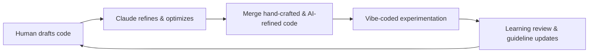

# Reborn Fan Site

This repository hosts the **Reborn Fan Site** codebase.  

The project is a **fan-made resource** for the game *[Reborn: An Idle Roguelike RPG](https://store.steampowered.com/app/2850000/Reborn_An_Idle_Roguelike_RPG/)*, but it is equally an **experiment in AI-assisted software development and institutional memory capture**. It demonstrates how structured guidelines, iterative refinement, and playful experimentation can combine to create a living, evolving codebase.  

---

## Purpose

The Reborn Fan Site project is designed to:  

- Serve as a **playground for AI-assisted coding**, where a human and [Claude](https://claude.ai/) collaborate to write, refine, and improve code.  
- Capture **institutional memory**, recording patterns, insights, and recurring challenges so that future work benefits from accumulated knowledge.  
- Explore a **hybrid coding workflow** that balances:  
  - **Hand-crafted code** – precise, deliberate human-written components.  
  - **AI-refined code** – segments polished or optimized using Claude's guidance.  
  - **Shamelessly vibe-coded experimentation** – spontaneous, creative, or exploratory code that tests new ideas without strict constraints.  

The repository emphasizes **learning, documentation, and iterative improvement** as much as functional output. Every session concludes with a “learning review” summarizing discoveries, mistakes, and insights, which feeds back into the evolving project guidelines documented in [CLAUDE.md](./CLAUDE.md).  

---

## Tech Stack

The project is built with modern frontend technologies, chosen for **modularity, speed, and flexibility**:  

- **React** – for building composable UI components.  
- **TypeScript** – providing type safety and improved maintainability.  
- **Tailwind CSS** – utility-first styling for rapid development.  
- **Vite** – lightning-fast build tool and development server.  

Supporting tools ensure code quality and consistency:  

- **ESLint & Prettier** – enforce consistent code style and formatting.  
- **TypeScript compiler (`tsc`)** – type checking and build validation.  
- **Husky Git hooks** – automatically run quality checks on commits to maintain standards.  

---

## AI + Iterative Refinement

A defining aspect of this project is the use of [Claude](https://claude.ai/) to assist with coding and iterative improvement. The workflow is designed to **blend human intuition with AI reasoning**:  

- **Structured collaboration**: Every AI-assisted session references the project's guidelines in [CLAUDE.md](./CLAUDE.md), ensuring decisions are aligned with established patterns.  
- **Learning reviews**: At the end of each session, a review summarizes key takeaways, tracks repeated mistakes, and proposes guideline updates.  
- **Continuous improvement**: Guidelines evolve over time to reflect what works and what doesn't, building a form of **institutional memory**.  
- **Hybrid coding**: The repository contains a mix of hand-crafted, AI-refined, and experimental “vibe-coded” components. This variety showcases the interplay between disciplined coding, AI optimization, and playful exploration.  

### Workflow Diagram

This loop illustrates the **iterative nature of development**, where every cycle captures lessons, refines patterns, and informs subsequent work.  

---

## Collaboration Philosophy

The project follows a **principled yet playful approach** to coding:  

- Adhere to existing patterns and established practices before introducing new ideas.  
- Prioritize **clarity, maintainability, and iterative refinement** over rushed changes.  
- Embrace experimentation within controlled contexts — not every experiment needs to succeed, but each informs the next iteration.  
- Ask for clarification rather than making assumptions; learning is valued over perfection.  
- Treat code as both a **learning artifact and a functional system**, balancing exploration with responsibility.  

---

> **Footnote:** This README was refined with the help of ChatGPT.
